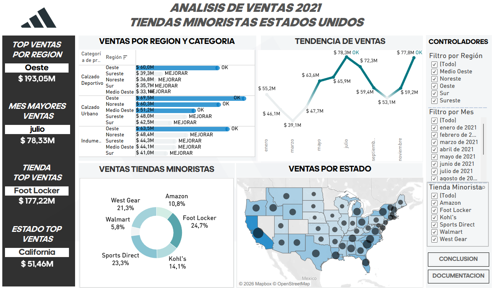
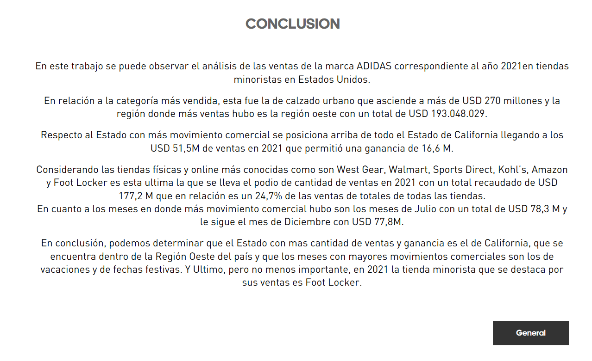

# 👟 Análisis de Ventas Adidas

## Descripción
Análisis de ventas de productos Adidas por región, canal de venta 
y categoría de producto.
Trabajo Final del curso Tableau — CoderHouse.

## Herramientas utilizadas
- Tableau
- Dataset de Kaggle

## 🔗 Ver dashboard interactivo
[Ver en Tableau Public](https://public.tableau.com/app/profile/carla.magui.a/viz/EntregaFinal_Maguia/Documentacin#1)

## Vista previa del dashboard

